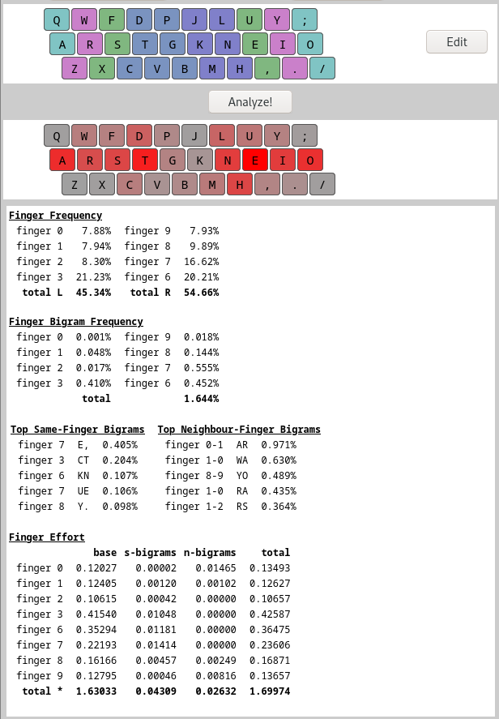
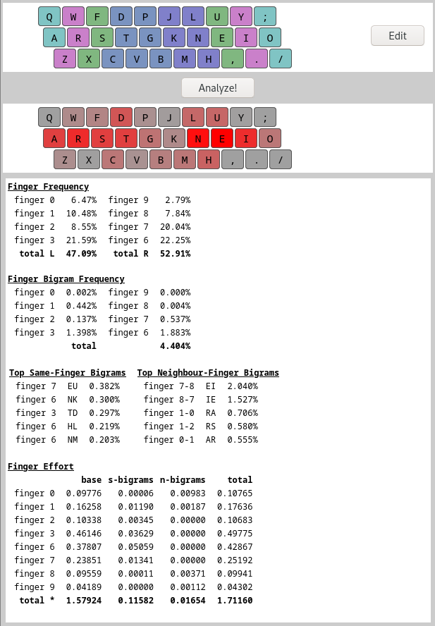

# EurKEY-Colemak-DPGHK

{width=500px}
{width=500px}

## Install

```bash
sudo install.sh
```

## Enable

```bash
setxkbmap eu eurkey-cmk-dpghk-ansi -option caps:escape
```
* Temporarily: Paste in shell
* Persistently: Paste into `~/.profile`
